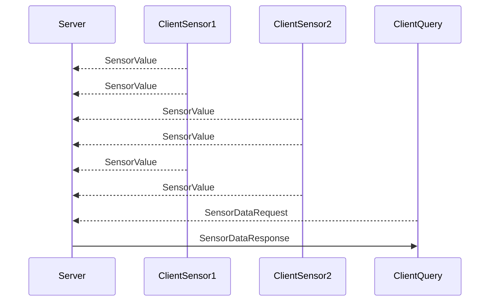

# Challenge goal
Create a server application that tracks sensor values submitted by one or more different client applications running on the same machine. A client can subsequently request previous values by signal name for a given sensor. Server and client are expected to be run under an embedded Linux environment with constrained resources, so care should be taken to be conservative of algorithms/libraries used. For this task, a test build running under macOS is also acceptable.



# Expected deliverable
The deliverable for this task is a branch with changes made to fulfill the challenge requirements. You will then submit a merge request of your branch into `master` branch. Please expand the README to describe the program's use as well as some how to build and run the server/client applications to verify it’s functionality.

## Provided code
The build system, nanomsg, protobufs dependencies are setup in the existing repo. A `libsensor_service` has been stubbed as a central location to put code common to `client` and `server`.

# Requirements
You will be expected to add to the existing code and build:
* a server program 
* client/sensor programs
(modifying the build scripts as necessary to support those services).

# Must do requirements
* Server and client applications written in C++.
* Use Cmake build system for building and linking executables.
* Server application communicates with clients using nanomsg protocol and IPC sockets.
* Sensor readings are submitted with a signal name and value (32-bit float). Acknowledgement not required for submission of signal values.
* More than one client can be connected to the server simultaneously.
* Past sensor readings are stored with timestamps.
* A client can request the latest submitted value for a particular signal name.
* A client can query past values for a certain signal based on signal name and/or timestamps.
* Sensor data is persisted between server instances using SQLite database.
* Messages between server and client serialized using Google Protocol Buffers.

# Additional features - bonus points if you finish these as well
* Perform unit testing using a test framework such as Google Test
* Track signal “status” using boolean thresholding (i.e. have an signal exhibit an error condition if it’s value surpasses a configured level)

# Building

## Bootstrap system
Required development tools and dependent libraries can be installed by running:
```
make bootstrap
make install_dependencies
```

## Build libraries and services
To build the `client` and `server` applications (along with `run_tests` executable), run:
```
make
```